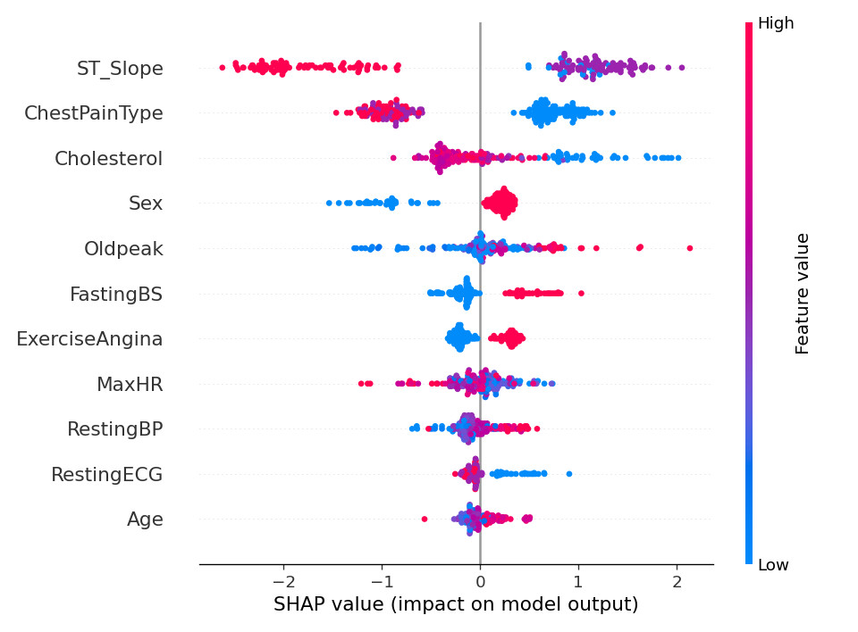

# Heart Disease Prediction — Interactive App

Predicts the presence of heart disease from a patient's clinical details, live in the browser. Enter a patient's data in the sidebar and get an instant prediction with a SHAP explanation of what drove it.

**[Try it live →](#)** *(add your Streamlit Community Cloud URL here once deployed)*

This started as a static analysis notebook comparing three models on the [Heart Failure Prediction Dataset](https://www.kaggle.com/datasets/fedesoriano/heart-failure-prediction) (Kaggle) — 918 patients combining the Cleveland, Hungarian, Switzerland, Long Beach VA, and Stalog heart datasets. The original notebook's analysis and results were sound (verified by re-running it end to end), so this rebuild keeps the same models and numbers and turns it into something a recruiter can actually click through, rather than just read.

---

## What changed from the original notebook

| | Original | This version |
|---|---|---|
| Format | Jupyter notebook, run top-to-bottom | Interactive Streamlit app |
| Interaction | None — fixed dataset, printed results | Sidebar inputs → live prediction for any patient |
| Explainability | Feature importances from the Decision Tree only | Per-prediction SHAP waterfall (why *this* patient), plus the global SHAP summary |
| Code | One notebook | Split into `data_preprocessing.py` / `model_training.py` / `explainability.py` / `app.py` |

The modelling itself is unchanged: same 3 models, same features, same train/test split, same results. This is a presentation upgrade, not a fix to broken work — the original analysis was correct.

---

## Results

| Model | Accuracy | ROC-AUC |
|---|---|---|
| Decision Tree | 78.8% | 0.786 |
| Random Forest | 87.5% | 0.924 |
| **Gradient Boosting** | **88.6%** | **0.939** |

Gradient Boosting is the champion model used in the app. The gap between the single Decision Tree and the two ensemble methods is expected — a lone tree overfits on a dataset this size (918 rows), while bagging and boosting both reduce that variance.

## What drives the prediction



Consistent with the original notebook's own feature-importance analysis:

1. **ST_Slope** — the direction of the ST segment on an ECG. The single strongest predictor. A flat or downward slope pushes the prediction sharply toward heart disease, matching clinical literature on cardiac ischaemia.
2. **ChestPainType** — asymptomatic chest pain (ASY) is *more* predictive of disease than typical angina, which is counterintuitive but well-documented.
3. **Cholesterol** — higher values push toward disease, as expected.
4. **Sex** — male patients skew toward higher predicted risk in this dataset.

The SHAP waterfall shown for each prediction in the app is specific to that patient's inputs, not a fixed importance ranking — it shows which of *their* values pushed the prediction up or down.

---

## Data

[Heart Failure Prediction Dataset](https://www.kaggle.com/datasets/fedesoriano/heart-failure-prediction) — public, Kaggle-hosted, no usage restrictions. Unlike some other projects in this portfolio, there's no privacy constraint here: the dataset ships with the repo and the app trains itself on it.

---

## Running it yourself

```bash
git clone https://github.com/Rhiya22/Heart_Disease_Prediction.git
cd Heart_Disease_Prediction
pip install -r requirements.txt
streamlit run app.py
```

The first run trains all three models and saves them to `models/` (a few seconds — the dataset is small); every run after that loads the saved model instantly. `models/` isn't committed to the repo on purpose (see `.gitignore`) — this keeps deployment simple and avoids any chance of a saved model being loaded by a different scikit-learn version than it was trained with. It just retrains fresh the first time the app starts.

To regenerate the results table and SHAP summary plot directly:

```bash
python model_training.py
python explainability.py
```

---

## Project structure

```
data/                    heart.csv (public dataset, committed)
data_preprocessing.py    loading + label-encoding categorical columns
model_training.py        trains & compares the 3 models, picks the champion
explainability.py        SHAP explanations (per-prediction and global summary)
app.py                   the Streamlit app
results/                 model_comparison.csv, shap_summary.png (committed - these are the public findings)
models/                  trained model files (not committed - regenerated on first run)
```

---

## Stack

Python, scikit-learn, SHAP, Streamlit, Plotly, pandas, matplotlib
